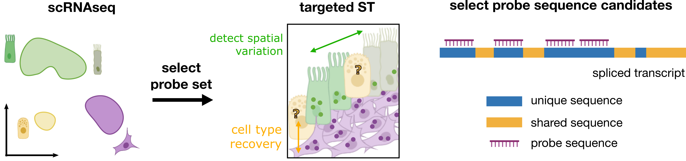
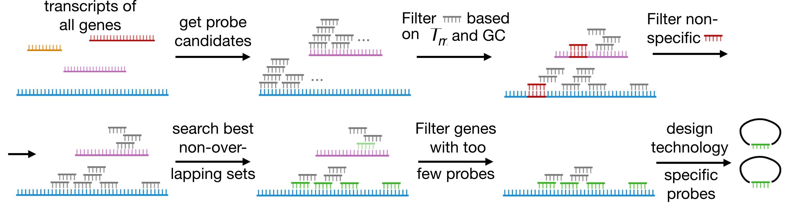
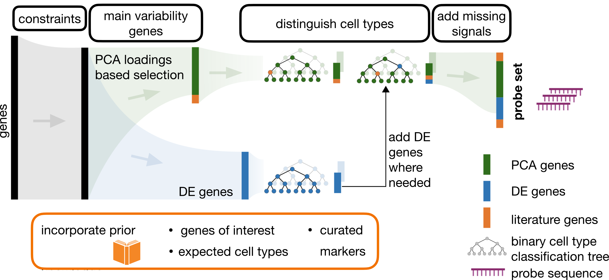
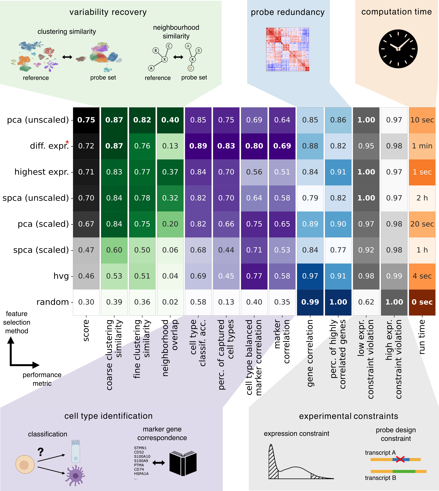

# spapros

[](https://pypi.org/project/spapros/)
[](https://pypi.org/project/spapros)
[](https://opensource.org/licenses/MIT)
[](https://spapros.readthedocs.io/)
[](https://github.com/theislab/spapros/workflows/Build%20spapros%20Package/badge.svg)
[](https://github.com/theislab/spapros/actions/workflows/run_tests.yml/badge.svg)
[](https://codecov.io/gh/theislab/spapros)
[](https://github.com/pre-commit/pre-commit)
[](https://github.com/psf/black)


## Installation

You can install _spapros_ via [pip](https://pip.pypa.io/) from [PyPI](https://pypi.org/):

```bash
pip install spapros
```

Alternatively, you can install _spapros_ using [conda](https://docs.conda.io/) or [mamba](https://mamba.readthedocs.io/):

```bash
mamba install -c bioconda spapros
```

## Usage

Visit our [documentation](https://spapros.readthedocs.io/en/latest/) for installation, tutorials, examples and more.

## Overview

Selecting the right gene set is critical for targeted spatial transcriptomics, where only a limited number of genes can be profiled in an experiment.
To select the set of genes, typically a scRNA-seq reference is used.
Based on such a reference Spapros aims to select a set of genes that simultaneously optimizes for cell type identification and transcriptional variation, while optionally ensuring compatibility with probe design requirements.



Below you find

-   A list of [questions that guide your specific experimental design](#experimental-design-questions)
-   A short description of the [selection pipeline](#selection-pipeline)
-   A short overview of the [gene set evaluation](#gene-set-evaluation)
-   For more details see our [paper](https://www.nature.com/articles/s41592-024-02496-z), [API documentation](https://spapros.readthedocs.io/en/latest/api.html) and [tutorials](https://spapros.readthedocs.io/en/latest/tutorials.html).

## Experimental design questions

Each experiment has a specific research question and potential experimental/budget constraints.
These specificities should be considered in the experimental design.

**Typical questions** that arise for the gene set selection are:

1. Are you only interested in cell type identification (e.g. cell type proportions and niche compositions)?
2. Or also in within-cell type variation?
3. How many genes do you want to profile?
4. Are you interested in a specific disease signature?
5. Are there pre-selected genes that you want to profile?
6. Are there cell types or signals that are expected in the spatial data but not in the scRNA-seq reference?
7. How good are the cell type annotations in the scRNA-seq reference?

Additionally, more technical questions that should be considered are:

8. How many cell type clusters are there in the scRNA-seq reference?
9. On which compute resources can you run the selection?
10. I have multiple selected gene panels. How can I find out which one is the best?

If you have additional experimental design questions, please don't hesitate to either [open a github issue](https://github.com/theislab/spapros/issues) or [contact us directly](mailto:louis.kummerle@helmholtz-munich.de).

**Answers to these questions**, to choose the most appropriate method and parameters for the probe set selection:

1. Run the selection with `n_pca_genes=0` (see e.g. [Cell type classification only](https://spapros.readthedocs.io/en/latest/_tutorials/spapros_tutorial_advanced_selection.html#ii.-Cell-type-classification-only) which refers to SpaprosCTo of our paper).
   Note that in this case less than `n` genes could be selected. If that happens, just run the selection multiple times (as done
   e.g. in [Selection for high numbers of genes (>150)](<https://spapros.readthedocs.io/en/latest/_tutorials/spapros_tutorial_advanced_selection.html#iii.-Selection-for-high-numbers-of-genes-(%3E-150)>)).
2. This refers to the default parameter setting of Spapros.
3. In case of more than 150 genes, it's recommended to sequentially run the selection multiple times
   (see [Selection for high numbers of genes (>150)](<https://spapros.readthedocs.io/en/latest/_tutorials/spapros_tutorial_advanced_selection.html#iii.-Selection-for-high-numbers-of-genes-(%3E-150)>)).
4. While Spapros tries to capture general variation, your main focus might lie on a subtle disease signature.
   In this case, you can either define additional "diseased" cell type clusters or manually identify additional
   DE genes (e.g. per cell type) and add them as pre-selection (see [Select a few additional genes](https://spapros.readthedocs.io/en/latest/_tutorials/spapros_tutorial_advanced_selection.html#i.-Select-a-few-additional-genes)).
5. You can use the `preselected_genes` argument to add a set of pre-selected genes (see [Select a few additional genes](https://spapros.readthedocs.io/en/latest/_tutorials/spapros_tutorial_advanced_selection.html#i.-Select-a-few-additional-genes)).
6. This problem can not be solved by Spapros' selection on the scRNA-seq reference. Some literature genes must be added
   manually (or can be provided as a marker list, see [Selection with curated marker list](https://spapros.readthedocs.io/en/latest/_tutorials/spapros_tutorial_advanced_selection.html#iv.-Selection-with-curated-marker-list)).
7. We highly recommend to use a well prepared scRNA-seq reference for the selection, to tailor the set of annotated cell types
   to the given research question. However, a selection on a generic leiden clustering will still capture the main variation
   in the dataset (in that case do not use `n_pca_genes=0`).
8. The time and memory consumption of Spapros selections grow with the number of cell types. In case of > 100 cell type
   clusters, you might want to split the data into coarse cell type groups (e.g. immune cells vs. others) and run the selection
   separately on each group.
9. We recommend to run Spapros on a node of a compute cluster. For the benchmarks in the paper we used 12 cpus and 64GB memory.
10. With the Spapros package we provide an evaluation scheme to evaluate and compare gene sets (see [Evaluation of gene sets](https://spapros.readthedocs.io/en/latest/_tutorials/spapros_tutorial_basic_evaluation.html)
    and [Advanced evaluation](https://spapros.readthedocs.io/en/latest/_tutorials/spapros_tutorial_advanced_evaluation.html)).

## Selection pipeline

Spapros is an end-to-end probe set selection pipeline. The pipeline performs optimized gene selection while optionally designing the probe sequence and accounting for technology-specific technical constraints. These aspects are considered jointly to deliver an optimal combinatorial probe set. If you are only interested in the gene panel selection jump to [gene panel selection](#gene-panel-selection), otherwise the [probe design and filter](#probe-design-and-filter) section is relevant.

### probe design and filter

Note that the probe design component of Spapros is implemented in the [oligo designer toolsuite package](https://oligo-designer-toolsuite.readthedocs.io/en/latest/). Follow our tutorial on the end-to-end selection to run the probe design filter, the gene panel selection and the probe design (see [End-to-end selection](https://spapros.readthedocs.io/en/latest/_tutorials/spapros_tutorial_end_to_end_selection.html)).
As a first step in the selection process, Spapros’ probe design component can be used to filter the full list of possible genes to exclude genes for which probes cannot be designed due to technology-specific technical constraints. These constraints include the availability of sufficient unique possible probe sequences, as well as sequence properties like GC-content and melting temperature requirements. Moreover, binding locations of the final probes for a given gene cannot overlap. Thus, we generate non-overlapping probe sets with optimal thermodynamic and sequence properties with a graph-based search algorithm. This probe design component supports a range of technologies, including SCRINSHOT, MERFISH, SeqFISH and HybISS, and is extensible to new technologies. Additionally, Spapros’ probe design filter can be used independently of the gene set selection process, making it compatible with other selection methods.



### gene panel selection

For the gene panel selection, Spapros selects genes that describe the overall variation in the scRNA-seq reference using a PCA-based selection procedure on a pre-selection of highly variable genes. To ensure cell types can be recovered using the gene set, Spapros uses the PCA-selected genes to predict cell type labels using a binary classification tree for each cell type. The genes used in these trees represent candidate cell type marker genes, and the tree itself provides a combinatorial rule, describing how the cell types can be identified in the generated spatial transcriptomics data. To ensure that all user-defined cell types can be identified, Spapros compares the classification performance for each cell type to the performance of reference trees. These trees are generated via a custom approach that iteratively optimizes for classifying similar cell identities. In each iteration Spapros performs DE selections on critical cell type subsets and retrains the trees on the extended gene pool. If any discrepancy in performance is found with the DE trees (that represent the optimal performance target), Spapros iteratively adds DE genes to the list of possible genes to improve classification performance. Finally, genes are ranked based on their feature importance in classification trees to allow for a user-defined number of selected genes. To facilitate downstream analysis in studies that solely focus on detecting cell type frequencies, it may be of interest to select only genes for cell type recovery rather than detecting additional spatial signals. For this, we provide SpaprosCTo (`n_pca_genes=0`), which exclusively utilizes DE trees for selection.



### technical constraints and prior knowledge

To account for technical constraints of expression levels a smoothed multiplicative penalty kernel is applied to the scores of PCA and DE based selections. See our tutorial on [expression constraints](https://spapros.readthedocs.io/en/latest/_tutorials/spapros_tutorial_advanced_selection.html#v.-Selection-with-expression-constraints) for more details.
While Spapros can select and design probe sets using only a reference scRNA-seq dataset and a list of cell types as input, users can also add prior knowledge and constraints to bias the algorithm toward user-defined genes. See our tutorials on [pre-selected genes](https://spapros.readthedocs.io/en/latest/_tutorials/spapros_tutorial_advanced_selection.html#i.-Select-a-few-additional-genes) and [marker lists](https://spapros.readthedocs.io/en/latest/_tutorials/spapros_tutorial_advanced_selection.html#iv.-Selection-with-curated-marker-list) for more details.

## Gene set evaluation

Spapros includes an evaluation suite to assess the quality of selected gene sets. Key metrics include:

1. Variation recovery: Evaluating the preservation of fine and global transcriptional variation.
2. Cell type recovery: Measuring how well the gene set distinguishes predefined cell types.
3. Gene redundancy: Assessing the redundancy of the selected genes.
4. Technical constraints: Ensuring adherence to design limitations, such as expression thresholds and probe sequence requirements. Note that this group is based on custom expression constraints (see [Expression constraints](https://spapros.readthedocs.io/en/latest/_tutorials/spapros_tutorial_advanced_selection.html#v.-Selection-with-expression-constraints)).

The metrics of group 1 and 2 are aggregated into an overall performance score in our comparison tables. Based on the specific experimental design demands the most appropriate metric can be chosen.



Find more details and discussion on the evaluations in

-   our [tutorials](https://spapros.readthedocs.io/en/latest/_tutorials/spapros_tutorial_advanced_evaluation.html)
-   our [paper](https://www.nature.com/articles/s41592-024-02496-z)

and an overview of our plotting functions for [visualizing the results](https://spapros.readthedocs.io/en/latest/api.html#plotting).

## How to cite

If you use Spapros in your research, please cite the following publication:
Kuemmerle, L. B., Luecken, M. D., et al. (2024). Probe set selection for targeted spatial transcriptomics. _Nature Methods_. https://doi.org/10.1038/s41592-024-02496-z

## Credits

This package was created with [cookietemple](https://cookietemple.com) using [Cookiecutter](https://github.com/audreyr/cookiecutter) based on [Hypermodern Python Cookiecutter](https://github.com/cjolowicz/cookiecutter-hypermodern-python).
